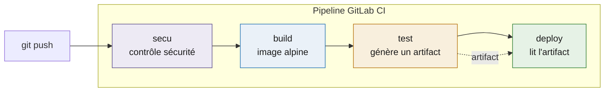
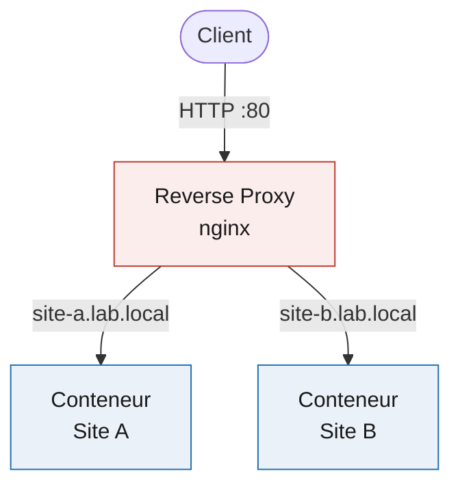
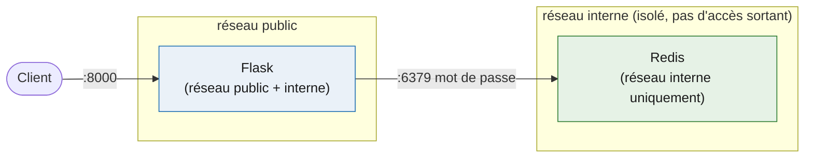

# Docker & GitLab CI/CD Lab

Travaux pratiques sur la conteneurisation avec Docker et l'automatisation de déploiement avec GitLab CI/CD. Conteneurisation d'applications, orchestration multi-conteneurs sécurisée, et construction de pipelines d'intégration continue.

## Pipeline CI/CD

## Architecture reverse proxy

## Application Flask + Redis

Redis n'est jamais exposé publiquement : il vit sur un réseau interne isolé, protégé par mot de passe, avec des limites de ressources et un healthcheck côté application.

## Contenu

- **gitlab-ci/** : pipeline GitLab CI (stages, variables, images par job, artifacts, dépendances)
- **reverse-proxy/** : plusieurs sites derrière un reverse proxy nginx qui route selon le domaine
- **flask-redis/** : application Flask couplée à Redis, réseaux isolés, secrets, limites de ressources

## Compétences illustrées

- Écriture de Dockerfiles et de fichiers docker-compose
- Isolation réseau entre conteneurs (base de données non exposée)
- Gestion des secrets via variables d'environnement (.env non versionné)
- Limitation des ressources (CPU, mémoire) et healthchecks
- Architecture reverse proxy multi-services
- Pipelines CI/CD : stages, artifacts, dépendances

## Prérequis

- Docker et Docker Compose
- Un runner GitLab pour la partie CI/CD

## Avertissement

Projet réalisé dans un cadre d'apprentissage. Configurations d'exemple, à adapter et durcir avant tout usage en production.
